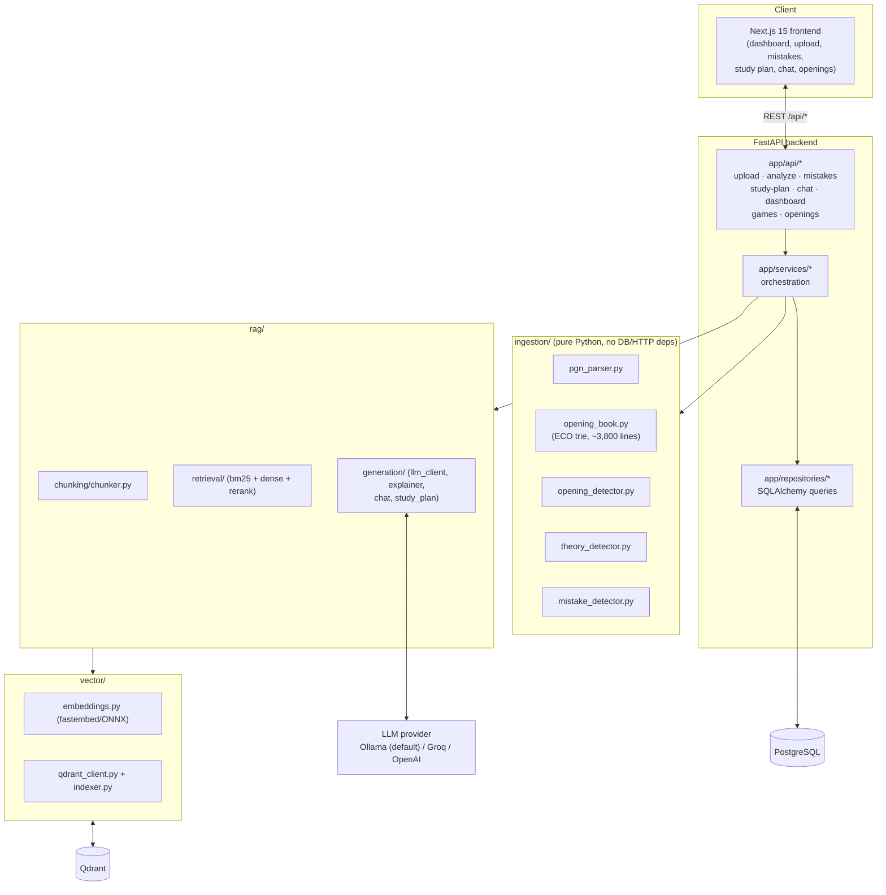

# Architecture

## System diagram



## Module boundaries

Each top-level directory is a separately testable, independently importable
module — nothing is monolithic:

- **`ingestion/`** has zero database or web-framework dependencies. It's a
  pure transformation: PGN text in, structured dataclasses out. This is why
  it has the heaviest unit-test coverage (`tests/unit/test_pgn_parser.py`,
  `test_opening_book.py`, `test_mistake_detector.py`) — it's the part of the
  system where a subtle bug is easiest to introduce and hardest to notice.
- **`rag/`** is split into `chunking` (docs → embeddable chunks),
  `retrieval` (BM25 + dense + rerank), and `generation` (LLM calls). The
  retrieval layer never imports the generation layer or vice versa — a
  citation-only chat response and a mistake explanation both consume the
  same `RerankedChunk` type, but retrieval doesn't know or care what its
  caller does with the results.
- **`vector/`** owns the only two things that talk to an ML model or Qdrant
  directly: `embeddings.py` (fastembed) and `qdrant_client.py` /
  `indexer.py`. Swapping the embedding model or the vector store only
  touches this directory.
- **`database/`** owns the schema (`models.py`), the async session factory
  (`session.py`), Alembic migrations, and seed scripts. `backend/app`
  depends on it; it does not depend on `backend/app`.
- **`backend/app`** is the thin orchestration layer: FastAPI routers call
  services, services call repositories (DB) and `ingestion`/`rag` (logic),
  and Pydantic schemas are the only thing that crosses the HTTP boundary.

## The hybrid retrieval pipeline

```
query
  │
  ├──► BM25 (sparse, exact keyword/notation match — "h6", "Ruy Lopez")
  │
  ├──► Dense vector search (Qdrant, semantic/paraphrase match)
  │
  ▼
merge (dedupe by point ID)
  │
  ▼
cross-encoder rerank (query+doc scored jointly — far more accurate,
                       too slow to run over the whole corpus)
  │
  ▼
top 5 chunks → LLM prompt, with citations
```

Dense-only search was verified (during development) to under-rank exact
keyword matches: querying "why is playing h6 too early a mistake" against
dense search alone surfaced Sicilian Defense chunks before the Italian Game
chunk that literally discusses ...h6. BM25 fixes this by rewarding the exact
token match; the reranker then re-scores the merged candidate pool with a
joint query+document encoder, which is the step that actually decides the
final top 5.

## Why mistake detection is heuristic, not engine-based

The specified tech stack does not include a chess engine (Stockfish or
similar), and this is deliberate: Opening Doctor is a *knowledge-based*
coach, not an engine-analysis tool. `ingestion/mistake_detector.py` encodes
well-known opening principles as deterministic rules:

| Mistake | Rule |
|---|---|
| Early queen development | Queen leaves its home square before move 6 |
| Delayed castling | No `O-O`/`O-O-O` by move ~10 |
| Premature pawn push | Flank pawn move (h6/h3/a6/a3/g4/b4/...) before move 6 with no tactical point (doesn't attack a piece) |
| Ignored center control | Neither d- nor e-pawn advanced by move 6 |
| Lost tempo | Same piece moves twice in a row, unforced (not a capture, not escaping check or an attack) |
| Repeated piece moves | A piece returns to a square it already occupied earlier in the game |

Each rule was validated against **real chess theory**, not just invented
logic — the test suite specifically includes the Ruy Lopez `Bb5-a4-b3`
bishop maneuver (a textbook main line) as a regression test, because a naive
implementation of "lost tempo" and "repeated piece moves" both initially
flagged it as a mistake. The fix: exclude moves that retreat from an active
attack (a forced, purposeful response) from both rules, and require a
*square revisit* — not just "moved again" — for repeated-piece-move
detection, since a piece touring b5→a4→b3 (three different squares) is not
the same pattern as a piece bouncing back to a square it already left.

The `eval_loss` field is therefore a **heuristic severity score** in a
pawn-like unit, calibrated so recurring, more-egregious mistakes score
worse — it is not a centipawn evaluation from a search tree, and the API/UI
never claims it is.

## LLM provider abstraction

`rag/generation/llm_client.py` wraps three providers behind one interface,
because Ollama, Groq, and OpenAI (and GPT-5) all expose an
OpenAI-compatible `/v1/chat/completions` endpoint. Switching providers is a
`.env` change (`LLM_PROVIDER=ollama|groq|openai`), not a code change. When
the configured provider has no API key (or, for Ollama, is simply not
running), `LLMClient.is_configured` is checked *before* any network call,
raising a typed `LLMNotConfiguredError` that FastAPI maps to a clean `503`
— `/api/chat` and `/api/mistakes?explain=true` never crash or silently
return an empty/hallucinated answer when the LLM isn't ready.

## Single-tenant scope

There is no user/auth system in this MVP. A PGN upload can optionally
include a `player_name`, matched case-insensitively against the PGN's
White/Black headers, to scope mistake detection to one side; without it,
both colors are analyzed. All games, mistakes, and dashboard stats are
global to the deployment — this is the right scope for a personal coaching
tool run locally or self-hosted for one player, and adding real multi-user
auth would be the natural next step before any shared/hosted deployment.
