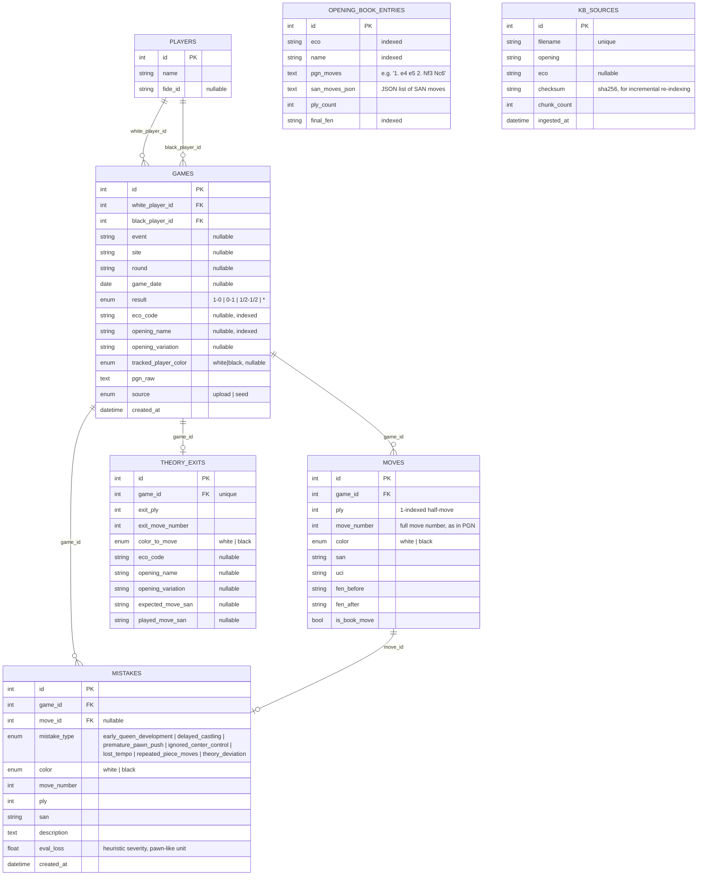

# Entity-relationship diagram

Generated from `database/models.py` (SQLAlchemy models) / the applied
Alembic migration `database/migrations/versions/7bf3e71785b6_initial_schema.py`.

## Notes

- `OPENING_BOOK_ENTRIES` and `KB_SOURCES` have no foreign keys to the game
  data — they're reference/tracking tables. `OPENING_BOOK_ENTRIES` mirrors
  the in-memory trie built from `database/seed/eco/*.tsv` (the lichess ECO
  dataset) so it can also be browsed/queried directly via SQL. `KB_SOURCES`
  tracks which `seed_data/openings/*.md` files have been chunked and indexed
  into Qdrant, keyed by content checksum, so re-running the indexing script
  is a no-op unless a document actually changed.
- The actual vector embeddings live in **Qdrant**, not Postgres — each
  point's payload carries the same metadata dimensions the spec requires
  (opening, variation, eco, color, difficulty, theme, source), plus the
  chunk text itself.
- `Mistake.eval_loss` and `TheoryExit` are populated by the ingestion
  pipeline (`ingestion/opening_detector.py`, `theory_detector.py`,
  `mistake_detector.py`) at upload/analyze time — see
  [ARCHITECTURE.md](ARCHITECTURE.md).
